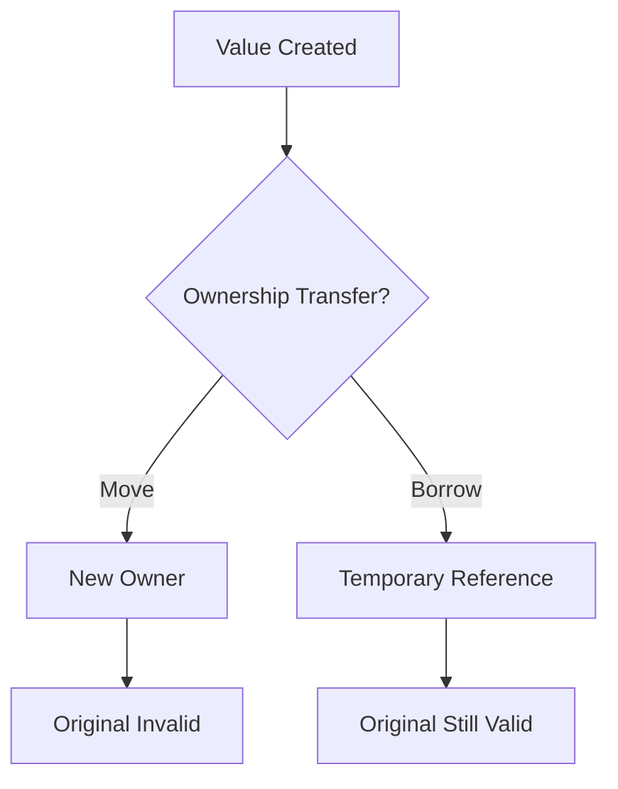

# Microsoft Rust Training

> Skill by [ara.so](https://ara.so) — Daily 2026 Skills collection.

A collection of seven structured Rust training books maintained by Microsoft, covering Rust from multiple entry points (C/C++, C#/Java, Python backgrounds) through deep dives on async, advanced patterns, type-level correctness, and engineering practices. Each book contains 15–16 chapters with Mermaid diagrams, editable Rust playgrounds, and exercises.

---

## Book Catalog

| Book | Level | Focus |
|------|-------|-------|
| `c-cpp-book` | 🟢 Bridge | Move semantics, RAII, FFI, embedded, no_std |
| `csharp-book` | 🟢 Bridge | C#/Java/Swift → ownership & type system |
| `python-book` | 🟢 Bridge | Dynamic → static typing, GIL-free concurrency |
| `async-book` | 🔵 Deep Dive | Tokio, streams, cancellation safety |
| `rust-patterns-book` | 🟡 Advanced | Pin, allocators, lock-free structures, unsafe |
| `type-driven-correctness-book` | 🟣 Expert | Type-state, phantom types, capability tokens |
| `engineering-book` | 🟤 Practices | Build scripts, cross-compilation, CI/CD, Miri |

---

## Installation & Setup

### Prerequisites

```bash
# Install Rust via rustup
curl --proto '=https' --tlsv1.2 -sSf https://sh.rustup.rs | sh

# Install mdBook and Mermaid preprocessor
cargo install mdbook mdbook-mermaid
```

### Clone and Build

```bash
git clone https://github.com/microsoft/RustTraining.git
cd RustTraining

# Build all books into site/
cargo xtask build

# Serve all books locally at http://localhost:3000
cargo xtask serve

# Build for GitHub Pages deployment (outputs to docs/)
cargo xtask deploy

# Clean build artifacts
cargo xtask clean
```

### Serve a Single Book

```bash
cd c-cpp-book && mdbook serve --open     # http://localhost:3000
cd python-book && mdbook serve --open
cd async-book && mdbook serve --open
```

---

## Repository Structure

```
RustTraining/
├── c-cpp-book/
│   ├── book.toml
│   └── src/
│       ├── SUMMARY.md          # Table of contents
│       └── *.md                # Chapter files
├── csharp-book/
├── python-book/
├── async-book/
├── rust-patterns-book/
├── type-driven-correctness-book/
├── engineering-book/
├── xtask/                      # Build automation (cargo xtask)
│   └── src/main.rs
├── docs/                       # GitHub Pages output
├── site/                       # Local preview output
└── .github/workflows/
    └── pages.yml               # Auto-deploy on push to master
```

---

## mdBook Configuration (`book.toml`)

Each book contains a `book.toml`. Example configuration pattern:

```toml
[book]
title = "Async Rust"
authors = ["Microsoft"]
language = "en"
src = "src"

[build]
build-dir = "../site/async-book"

[preprocessor.mermaid]
command = "mdbook-mermaid"

[output.html]
default-theme = "navy"
preferred-dark-theme = "navy"
git-repository-url = "https://github.com/microsoft/RustTraining"
edit-url-template = "https://github.com/microsoft/RustTraining/edit/master/{path}"

[output.html.search]
enable = true
```

---

## Key Rust Concepts Covered by Book

### Bridge: Rust for C/C++ Programmers

**Ownership & Move Semantics**

```rust
// C++ has copy by default; Rust moves by default
fn take_ownership(s: String) {
    println!("{s}");
} // s is dropped here

fn main() {
    let s = String::from("hello");
    take_ownership(s);
    // println!("{s}"); // ERROR: s was moved
    
    // Use clone for explicit deep copy
    let s2 = String::from("world");
    let s3 = s2.clone();
    println!("{s2} {s3}"); // Both valid
}
```

**RAII — No Manual Memory Management**

```rust
use std::fs::File;
use std::io::{self, Write};

fn write_data(path: &str, data: &[u8]) -> io::Result<()> {
    let mut file = File::create(path)?; // Opens file
    file.write_all(data)?;
    Ok(())
} // file automatically closed here — no explicit close needed
```

**FFI Example**

```rust
// Calling C from Rust
extern "C" {
    fn abs(x: i32) -> i32;
}

fn main() {
    unsafe {
        println!("abs(-5) = {}", abs(-5));
    }
}
```

---

### Bridge: Rust for Python Programmers

**Static Typing with Type Inference**

```rust
// Python: x = [1, 2, 3]
// Rust infers the type from usage:
let mut numbers = Vec::new();
numbers.push(1_i32);
numbers.push(2);
numbers.push(3);

// Explicit when needed:
let numbers: Vec<i32> = vec![1, 2, 3];
```

**Error Handling (no exceptions)**

```rust
use std::num::ParseIntError;

fn double_number(s: &str) -> Result<i32, ParseIntError> {
    let n = s.trim().parse::<i32>()?; // ? propagates error
    Ok(n * 2)
}

fn main() {
    match double_number("5") {
        Ok(n) => println!("Doubled: {n}"),
        Err(e) => println!("Error: {e}"),
    }
}
```

**GIL-Free Concurrency**

```rust
use std::thread;
use std::sync::{Arc, Mutex};

fn main() {
    let counter = Arc::new(Mutex::new(0));
    let mut handles = vec![];

    for _ in 0..10 {
        let counter = Arc::clone(&counter);
        let handle = thread::spawn(move || {
            let mut num = counter.lock().unwrap();
            *num += 1;
        });
        handles.push(handle);
    }

    for handle in handles {
        handle.join().unwrap();
    }

    println!("Result: {}", *counter.lock().unwrap()); // 10
}
```

---

### Deep Dive: Async Rust

**Basic Async with Tokio**

```rust
use tokio::time::{sleep, Duration};

#[tokio::main]
async fn main() {
    let result = fetch_data().await;
    println!("{result}");
}

async fn fetch_data() -> String {
    sleep(Duration::from_millis(100)).await;
    "data loaded".to_string()
}
```

**Concurrent Tasks**

```rust
use tokio::task;

#[tokio::main]
async fn main() {
    let (a, b) = tokio::join!(
        task::spawn(async { expensive_computation(1).await }),
        task::spawn(async { expensive_computation(2).await }),
    );
    println!("{} {}", a.unwrap(), b.unwrap());
}

async fn expensive_computation(n: u64) -> u64 {
    tokio::time::sleep(std::time::Duration::from_millis(n * 100)).await;
    n * 42
}
```

**Cancellation-Safe Streams**

```rust
use tokio_stream::{self as stream, StreamExt};

#[tokio::main]
async fn main() {
    let mut s = stream::iter(vec![1, 2, 3, 4, 5]);
    while let Some(value) = s.next().await {
        println!("got {value}");
    }
}
```

---

### Advanced: Rust Patterns

**Type-Safe Builder Pattern**

```rust
#[derive(Debug)]
struct Config {
    host: String,
    port: u16,
    max_connections: usize,
}

struct ConfigBuilder {
    host: String,
    port: u16,
    max_connections: usize,
}

impl ConfigBuilder {
    fn new() -> Self {
        Self {
            host: "localhost".into(),
            port: 8080,
            max_connections: 100,
        }
    }
    fn host(mut self, h: impl Into<String>) -> Self { self.host = h.into(); self }
    fn port(mut self, p: u16) -> Self { self.port = p; self }
    fn max_connections(mut self, m: usize) -> Self { self.max_connections = m; self }
    fn build(self) -> Config {
        Config { host: self.host, port: self.port, max_connections: self.max_connections }
    }
}

fn main() {
    let config = ConfigBuilder::new()
        .host("0.0.0.0")
        .port(9090)
        .max_connections(500)
        .build();
    println!("{config:?}");
}
```

**Custom Allocator**

```rust
use std::alloc::{GlobalAlloc, Layout, System};
use std::sync::atomic::{AtomicUsize, Ordering};

static ALLOCATED: AtomicUsize = AtomicUsize::new(0);

struct TrackingAllocator;

unsafe impl GlobalAlloc for TrackingAllocator {
    unsafe fn alloc(&self, layout: Layout) -> *mut u8 {
        ALLOCATED.fetch_add(layout.size(), Ordering::Relaxed);
        System.alloc(layout)
    }
    unsafe fn dealloc(&self, ptr: *mut u8, layout: Layout) {
        ALLOCATED.fetch_sub(layout.size(), Ordering::Relaxed);
        System.dealloc(ptr, layout)
    }
}

#[global_allocator]
static A: TrackingAllocator = TrackingAllocator;

fn main() {
    let _v: Vec<u8> = vec![0u8; 1024];
    println!("Allocated: {} bytes", ALLOCATED.load(Ordering::Relaxed));
}
```

---

### Expert: Type-Driven Correctness

**Typestate Pattern**

```rust
use std::marker::PhantomData;

struct Locked;
struct Unlocked;

struct Safe<State> {
    contents: String,
    _state: PhantomData<State>,
}

impl Safe<Locked> {
    fn new(contents: impl Into<String>) -> Self {
        Safe { contents: contents.into(), _state: PhantomData }
    }
    fn unlock(self, _key: &str) -> Safe<Unlocked> {
        Safe { contents: self.contents, _state: PhantomData }
    }
}

impl Safe<Unlocked> {
    fn get_contents(&self) -> &str { &self.contents }
    fn lock(self) -> Safe<Locked> {
        Safe { contents: self.contents, _state: PhantomData }
    }
}

fn main() {
    let safe = Safe::<Locked>::new("secret data");
    // safe.get_contents(); // ERROR: method not available on Locked state
    let open = safe.unlock("correct-key");
    println!("{}", open.get_contents());
    let _locked_again = open.lock();
}
```

**Phantom Types for Unit Safety**

```rust
use std::marker::PhantomData;

struct Meters;
struct Feet;

struct Distance<Unit> {
    value: f64,
    _unit: PhantomData<Unit>,
}

impl<Unit> Distance<Unit> {
    fn new(value: f64) -> Self {
        Distance { value, _unit: PhantomData }
    }
    fn value(&self) -> f64 { self.value }
}

impl Distance<Meters> {
    fn to_feet(self) -> Distance<Feet> {
        Distance::new(self.value * 3.28084)
    }
}

fn main() {
    let d_m: Distance<Meters> = Distance::new(100.0);
    let d_f: Distance<Feet> = d_m.to_feet();
    println!("{:.2} feet", d_f.value());
    // Can't mix units — type system prevents it
}
```

---

### Practices: Rust Engineering

**Build Script (`build.rs`)**

```rust
// build.rs — runs before compilation
fn main() {
    // Tell Cargo to rerun if C source changes
    println!("cargo:rerun-if-changed=src/native/lib.c");
    
    // Compile a C library
    cc::Build::new()
        .file("src/native/lib.c")
        .compile("native");
    
    // Emit link search path
    println!("cargo:rustc-link-search=native=/usr/local/lib");
    println!("cargo:rustc-link-lib=ssl");
}
```

**Cross-Compilation**

```bash
# Add a target
rustup target add aarch64-unknown-linux-gnu

# Build for that target
cargo build --target aarch64-unknown-linux-gnu

# In .cargo/config.toml:
# [target.aarch64-unknown-linux-gnu]
# linker = "aarch64-linux-gnu-gcc"
```

**Running Miri for Undefined Behavior Detection**

```bash
# Install Miri
rustup component add miri

# Run tests under Miri
cargo miri test

# Run a specific binary under Miri
cargo miri run
```

---

## Adding Content to a Book

### SUMMARY.md Structure

```markdown
# Summary

- [Introduction](./introduction.md)
- [Chapter 1: Ownership](./ch01-ownership.md)
  - [Borrowing](./ch01-borrowing.md)
  - [Lifetimes](./ch01-lifetimes.md)
- [Chapter 2: Types](./ch02-types.md)
```

### Mermaid Diagrams in Chapters

````markdown

````

### Rust Playground Links

```markdown
You can run this example in the [Rust Playground](https://play.rust-lang.org/?version=stable&mode=debug&edition=2021&code=fn+main()+%7B+println!(%22Hello%22)%3B+%7D).
```

---

## xtask Automation

The `xtask` pattern lets you write build scripts in Rust instead of shell:

```rust
// xtask/src/main.rs — simplified pattern
use std::process::Command;

fn main() {
    let task = std::env::args().nth(1).unwrap_or_default();
    match task.as_str() {
        "build" => build_all(),
        "serve" => serve_all(),
        "deploy" => deploy(),
        "clean" => clean(),
        _ => eprintln!("Unknown task: {task}"),
    }
}

fn build_all() {
    for book in &["c-cpp-book", "python-book", "async-book"] {
        let status = Command::new("mdbook")
            .args(["build", book])
            .status()
            .expect("mdbook not found");
        assert!(status.success(), "Failed to build {book}");
    }
}
```

Run with: `cargo xtask build` (configured in `.cargo/config.toml` as an alias).

---

## CI/CD — GitHub Pages Deployment

```yaml
# .github/workflows/pages.yml
name: Deploy to GitHub Pages
on:
  push:
    branches: [master]
jobs:
  deploy:
    runs-on: ubuntu-latest
    steps:
      - uses: actions/checkout@v4
      - uses: dtolnay/rust-toolchain@stable
      - run: cargo install mdbook mdbook-mermaid
      - run: cargo xtask deploy
      - uses: peaceiris/actions-gh-pages@v3
        with:
          github_token: ${{ secrets.GITHUB_TOKEN }}
          publish_dir: ./docs
```

---

## Troubleshooting

### `mdbook` command not found
```bash
cargo install mdbook mdbook-mermaid
# Ensure ~/.cargo/bin is in your PATH
export PATH="$HOME/.cargo/bin:$PATH"
```

### Mermaid diagrams not rendering
```bash
# Ensure preprocessor is installed
cargo install mdbook-mermaid

# Verify book.toml has:
# [preprocessor.mermaid]
# command = "mdbook-mermaid"
```

### Port already in use
```bash
# Specify a different port
mdbook serve --port 3001
```

### Build fails on specific book
```bash
cd <book-name>
mdbook build 2>&1   # See full error output
```

### Miri test failures
```bash
# Update Miri to latest nightly
rustup update nightly
rustup component add miri --toolchain nightly
cargo +nightly miri test
```

### Cross-compilation linker errors
```bash
# Install cross (Docker-based cross compilation)
cargo install cross
cross build --target aarch64-unknown-linux-gnu
```

---

## Reading Path Recommendations

**New to Rust, coming from Python:**
`python-book` → `async-book` → `rust-patterns-book`

**Coming from C/C++:**
`c-cpp-book` → `rust-patterns-book` → `type-driven-correctness-book`

**Coming from C#/Java:**
`csharp-book` → `async-book` → `engineering-book`

**Already know Rust basics:**
`rust-patterns-book` → `type-driven-correctness-book` → `engineering-book`

**Production Rust:**
`engineering-book` + `async-book` (cancellation safety chapters)

---

## License

Dual-licensed under [MIT](LICENSE) and [CC-BY-4.0](LICENSE-DOCS). Code examples are MIT; prose and diagrams are CC-BY-4.0.
